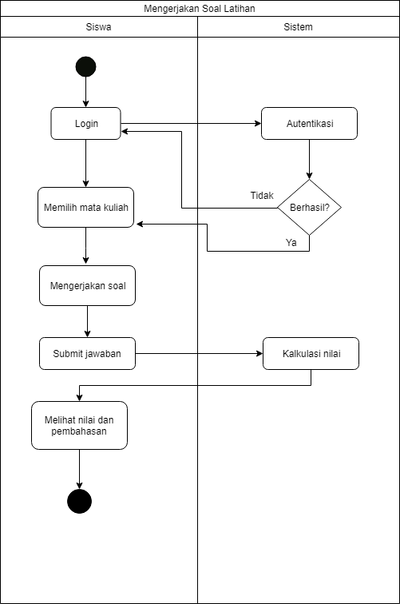
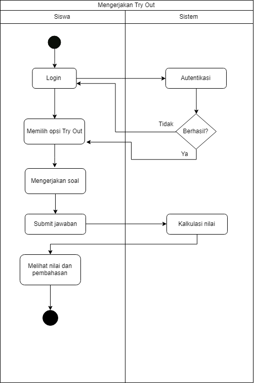
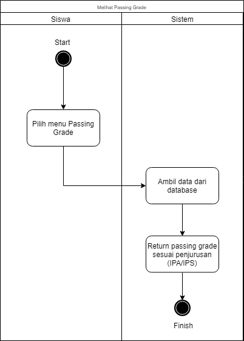
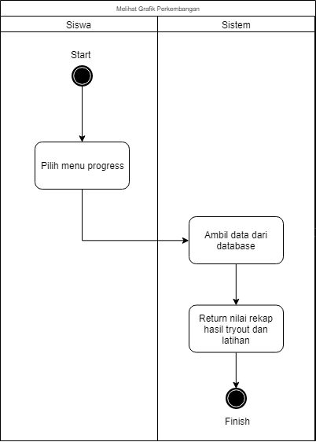
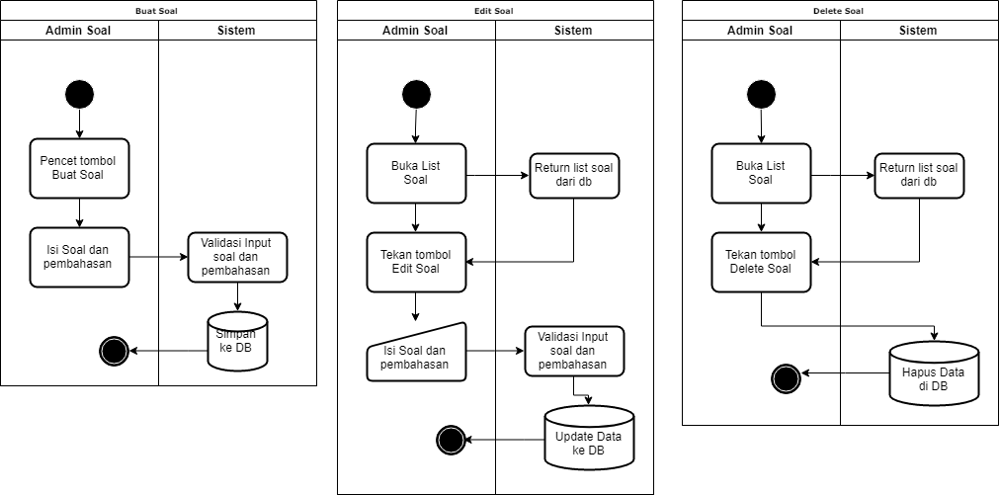
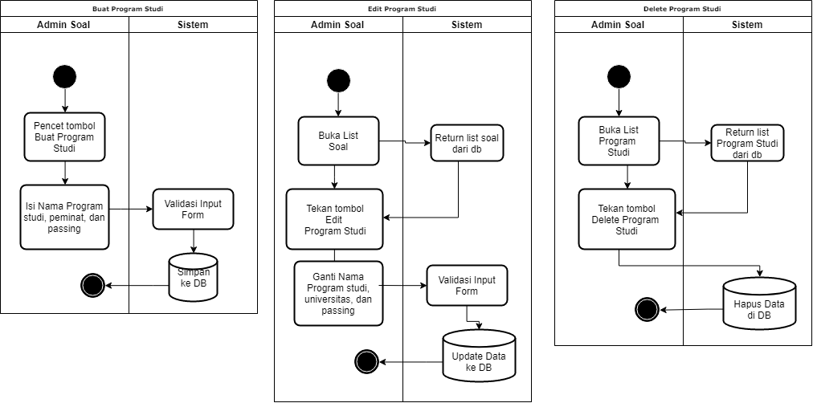

<h1 align="center"></h1>

[Tentang Aplikasi](#tentang-aplikasi) | [Use Case Diagram](#use-case-diagram) | [Activity Diagram](#activity-diagram) | [Class Diagram](#class-diagram) | [Sequence Diagram](#sequence-diagram) | [Design Pattern](#design-pattern)  | [Anti Pattern](#anti-pattern) 
:---:|:---:|:---:|:---:|:---:|:---:|:---:

# Tentang Aplikasi
[`^ kembali ke atas ^`](#)

**SBM-Buddy** adalah aplikasi pembelajaran berbasis *web* untuk membantu siswa-siswi kelas 3 SMA dalam menghadapi ujian SBMPTN. **SBM-Buddy** menyediakan soal-soal SBMPTN serta memprediksi nilai *Passing Grade*, dan perkembangan *Passing Grade* siswa tiap waktu. **SBM-Buddy** juga menyediakan *list* *Passing Grade* beberapa program studi di universitas-universitas yang ada di Indonesia.

# Use Case Diagram
[`^ kembali ke atas ^`](#)
<h1 align="center"></h1>

## UC1 : Mengerjakan Soal
- **Importance Level :** High
- **Use Case Type :** Essential
- **Primary Actor :** Siswa
- **Stakeholder and Interest :** 
    - Siswa : Mengerjakan soalnya
    - Admin : Membuat soal, menentukan penilaian
- **Brief Description :** Di dalam use case ini dijelaskan bagaimana siswa mengerjakan soal
- **Pre-Condition :** Siswa harus register/login 
- **Trigger :** Siswa memilih soal yang ingin dikerjakan
    - **Type :** External
- **Relationship :**
    - Association : Admin
- **Normal Flow of Events :**
    1. Siswa Login
    2. Siswa memilih jenis soal yang ingin dikerjakan (Latihan/Try Out)
    3. Siswa mengerjakan soal
    4. Siswa Submit Soal
- **Alternate/Exceptional Flows :**
    1E. Siswa gagal login
- **Post-Condition :** Siswa dapat mengakses pembahasan soal dan grafik perkembangan

## UC2 : Melihat Pembahasan Soal
- **Importance Level :** High
- **Use Case Type :** Essential
- **Primary Actor :** Siswa
- **Stakeholder and Interest :** 
    - Siswa : Melihat Pembahasan Soal
    - Admin : Menambahkan Pembahasan Soal
- **Brief Description :**  Di dalam use case ini dijelaskan bagaimana siswa dapat mengakses pembahasan soal
- **Pre-Condition :** Siswa mengerjakan soal tersebut
- **Trigger :** Siswa selesai mengerjakan soal
    - **Type :** External
- **Relationship :**
    - Association : Admin
    - Include : Mengerjakan Soal
- **Normal Flow of Events :**
    1. Siswa selesai mengerjakan soal
    2. Pembahasan soal ditampilkan
- **Alternate/Exceptional Flows :**
    2E . Pembahasan belum tersedia

## UC3 : Melihat grafik perkembangan
- **Importance Level :** Medium
- **Use Case Type :** Essential, System
- **Primary Actor :** Siswa
- **Stakeholder and Interest :** 
    - Siswa : Melihat grafik 
- **Brief Description :** Di dalam use case ini dijelaskan bagaimana siswa dapat melihat grafik perkembangan nilai
- **Pre-Condition :** Siswa harus menyelesaikan minimal 1 set soal
- **Trigger :** Siswa mengakses laman perkembangan
    - **Type :** External
- **Normal Flow of Events :**
    1. Siswa membuka profil
    2. Siswa melihat grafik perkembangan nilai Try Out 

## UC4 : Melihat grafik intensitas pengerjaan soal
- **Importance Level :** Medium
- **Use Case Type :** Essential, System
- **Primary Actor :** Siswa
- **Stakeholder and Interest :** 
    - Siswa : Melihat grafik
- **Brief Description :**  Di dalam use case ini dijelaskan bagaimana siswa dapat melihat grafik  intensitas pengerjaan soal dalam satuan waktu.
- **Pre-Condition :** Siswa harus menyelesaikan minimal 1 set soal
- **Trigger :** Siswa ingin melihat sebanyak apa soal yang telah dikerjakan
    - **Type :** External
- **Normal Flow of Events :**
    1. Siswa membuka profil
    2. Siswa melihat grafik grafik  intensitas pengerjaan soal dalam satuan waktu

## UC5 : Melihat passing grade program studi
- **Importance Level :** Medium
- **Use Case Type :** System, Essential
- **Primary Actor :** Siswa
- **Stakeholder and Interest :** 
    - Siswa : Melihat passing grade
    - Admin : Menambah/mengubah passsing grade
- **Brief Description :**  Di dalam use case ini dijelaskan bagaimana siswa melihat passing grade program studi
- **Trigger :** Siswa ingin melihat universitas / prodi yang direkomendasikan
    - **Type :** External
- **Relationship :**
    - Association : Admin
- **Normal Flow of Events :**
    1. Siswa membuka profil
    2. Siswa melihat bagian passing grade

## UC6 : Membuat Soal dan Pembahasan
- **Importance Level :** High
- **Use Case Type :** Essential
- **Primary Actor :** Admin
- **Stakeholder and Interest :** 
    - Admin : Membuat paket soal baru
- **Brief Description :** Di dalam use case ini dijelaskan bagaimana admin soal dapat membuat soal dan pembahasannya
- **Pre-Condition :** User harus merupakan seorang admin
- **Trigger :** Admin membuka laman penambahan soal
    - **Type :** External
- **Normal Flow of Events :**
    1. Admin login
    2. Admin menambah paket soal baru
    3. Admin memasukkan setiap butir soal
    4. Admin memasukkan jawaban soal tersebut
    5. Admin memasukkan pembahasan tiap soal
    6. Admin menyimpan soal tersebut

## UC7 : Merubah soal dan pembahasan
- **Importance Level :** Low
- **Use Case Type :** Essential
- **Primary Actor :** Admin
- **Stakeholder and Interest :** 
    - Admin : Ingin merubah soal dan pembahasan dari mata pelajaran yang diujikan.
- **Brief Description :** Di dalam use case ini dijelaskan bagaimana Admin merubah soal dan pembahasan dari mata pelajaran yang diujikan.
- **Pre-Condition :** User harus merupakan seorang admin
- **Trigger :** Terdapat kesalahan saat menginput soal 
    - **Type :** External
- **Normal Flow of Events :**
    1. Admin membuka list soal ujian.
    2. Admin merubah soal dan pembahasan dari ujian yang dipilih.

## UC8 : Menghapus soal dan pembahasan
- **Importance Level :** Low
- **Use Case Type :** Essential
- **Primary Actor :** Admin
- **Stakeholder and Interest :** 
    - Admin : Menghapus paket soal
- **Brief Description :** Di dalam use case ini dijelaskan bagaimana Admin dapat menghapus paket soal atau pembahasan 
- **Pre-Condition :** -
- **Trigger :** Soal sudah tidak relevan lagi
    - **Type :** External
- **Normal Flow of Events :**
    1. Admin membuka paket-paket soal
    2. Admin memilih paket soal yang akan dihapus
    3. Admin menghapus soal tersebut
    4. Admin melakukan konfirmasi penghapusan

## UC9 : Merubah passing grade program studi
- **Importance Level :** Medium
- **Use Case Type :** Essential
- **Primary Actor :** Admin
- **Stakeholder and Interest :** 
    - Admin : Ingin memperbarui passing grade program studi di sebuah universitas.
- **Brief Description :** Di dalam use case ini dijelaskan bagaimana Admin merubah passing grade program studi di sebuah universitas.
- **Pre-Condition :** User harus merupakan seorang admin
- **Trigger :** Perubahan nilai passing grade dari program studi per tahun.
    - **Type :** Temporal
- **Normal Flow of Events :**
    1. Admin membuka list universitas.
    2. Admin memilih program studi.
    3. Admin merubah passing grade program studi. 

## UC10 :Menambah program studi
- **Importance Level :** Medium
- **Use Case Type :** Essential, System
- **Primary Actor :** Admin
- **Stakeholder and Interest :** 
    - Admin : Ingin menambah program studi di sebuah universitas.
- **Brief Description :** Di dalam use case ini dijelaskan bagaimana Admin menambah program studi di sebuah universitas.
- **Pre-Condition :** User harus merupakan seorang admin
- **Trigger :** Universitas membuka program studi baru.
    - **Type :** External
- **Normal Flow of Events :**
    1. Admin membuka list universitas.
    2. Admin menambah program studi.

## UC11 : Menghapus program studi
- **Importance Level :** Low
- **Use Case Type :** Essential, System
- **Primary Actor :** Admin
- **Stakeholder and Interest :** 
    - Admin : Ingin menghapus program studi di sebuah universitas.
- **Brief Description :** Di dalam use case ini dijelaskan bagaimana Admin menghapus program studi di sebuah universitas.
- **Pre-Condition :** User harus merupakan seorang admin
- **Trigger :** Universitas menutup program studi yang ada karena alasan tertentu.
    - **Type :** External
- **Normal Flow of Events :**
    1. Admin membuka list universitas.
    2. Admin menghapus program studi

# Activity Diagram
[`^ kembali ke atas ^`](#)
<h1 align="center"></h1>
<h1 align="center"></h1>
Fitur utama pada siswa di SBM-Buddy yaitu mengerjakan soal SBMPTN yang sudah tersedia. Pengerjaan soal terbagi menjadi dua mode, yaitu mengerjakan soal latihan dimana siswa dapat memilih satu mata pelajaran saja untuk berlatih, sementara pada try out, siswa harus mengerjakan seluruh mara pelajaran satu paket, mirip seperti SBMPTN sesungguhnya.
<h1 align="center"></h1>
<h1 align="center"></h1>
Fitur tambahan pada siswa adalah melihat passing grade serta melihat perkembangan dalam pengerjaan soal. Alur pada kedua fitur ini sederhana dan mudah untuk diakses.
<h1 align="center"></h1>
Fitur create, read, update, serta delete program studi sekaligus passing gradenya hanya dapat dilakukan oleh admin. Proses pengerjaannya sederhana, tidak terdapat requirement khusus sebelum melakukannya.
<h1 align="center"></h1>
Fitur create, read, update, serta delete soal merupakan fitur utama dari admin. Mirip seperti CRUD program studi, fitur-fitur ini dirancang sederhana dan mudah digunakan. Satu-satunya syarat untuk menggunakan fitur ini adalah login sebagai admin.

# Class Diagram
[`^ kembali ke atas ^`](#)
<h1 align="center"></h1>
Terdapat 7 kelas dan 2 kelas asosiasi pada aplikasi ini. Kelas user merupakan kelas untuk mengimplementasikan pengguna pada aplikasi. Kelas memiliki dua keturunan, yaitu kelas admin dan siswa. Kelas siswa memiliki satu atribut tambahan, yaitu jurusan karena pengguna siswa terbagi menjadi dua, yaitu siswa IPA dan siswa IPS. Siswa dapat melakukan register sementara admin tidak bisa karena admin hanya ada satu. Kelas jurusan  merupakan kelas untuk mengimplementasikan program studi serta passing gradenya. Program studi atau jurusan dapat ditambahkan, dihapus, dilihat, serta dimodifikasi oleh admin. Kelas paket adalah kelas untuk mengimplementasikan paket soal. Satu paket soal mempunyai soal-soal matematika, fisika, kimia, biologi (untuk IPA) atau geografi, sejarah, ekonomi, sosiologi yang masing-masing berjumlah 15 soal. Soal dibuat oleh admin dan dikerjakan oleh siswa. Soal dan paket dihubungkan dengan kelas asosiasi paket soal. Penilaian pengerjaan soal dilakukan oleh kelas nilai yang hasilnya akan disimpan pada rapor. Kelas rapor adalah kelas yang mengimplementasikan penyimpanan dan penampilan riwayat pengerjaan soal siswa.

# Sequence Diagram
[`^ kembali ke atas ^`](#)
<h1 align="center"></h1>
Sequence diagram di atas menunjukan bahwa terdapat 2 aktor pada sistem yakni siswa dan admin, dan terdapat 3 objek pada sistem yakni soal, program studi, dan nilai. Jika siswa memulai aktivitas dengan tanda panah (→) doPemanasan maka akan diberikan soal soal yang akan dikerjakan oleh siswa sesuai dengan jurusannya dan kemudian akan dijalankan modul gradeSoal yang akan menilai soal sesuai dengan tingkat kebenarannya dan mengembalikan nilai nya kepada user.

# Design Pattern
[`^ kembali ke atas ^`](#)
1. Private Class Data
Design pattern ini digunakan mengurangi keterbukaan atribut dengan membatasi visibilitasnya. Private Class Data mengatasi masalah di atas dengan mengekstraksi kelas data untuk kelas target dan memberikan instance kelas target instance kelas data yang di ekstraksi. Terdapat fungsi guard() untuk memeriksa apakah akun tersebut terverifikasi sebagai user atau admin. Guard() bersifat rahasia, sehingga hanya bisa diakses dengan AuthController saja.
2. Singleton
Singleton adalah kelas yang anggota instancenya hanya satu. Terdapat kelas admin pada sistem SBM Buddy. Admin yang dibutuhkan untuk mengatur keseluruhan sistem hanya satu, sehingga kelas admin hanya terdiri dari satu user, yaitu admin itu sendiri.

# Anti Pattern
[`^ kembali ke atas ^`](#)
1. Functional Decomposition
AntiPattern ini merupakan hasil dari developer nonobject-oriented yang mengimplementasikan aplikasi di bahasa pemrograman yang object oriented. AntiPattern berakibat pada developer yang mengabaikan hirarki kelas atau bahkan konsep object-oriented pada produk. Antipattern ini terjadi pada saat membuat kelas User. User terbagi menjadi dua subclass, admin dan siswa. Namun, pada tahap implementasinya, tidak ada perbedaan yang signifikan terhadap admin dan siswa. 
2. Smoke and Mirrors
Smoke and Mirrors adalah salah satu antipattern dimana developer mempromosikan dan menjanjikan fitur-fitur di luar kemampuan developer tersebut. Smoke and Mirror terjadi karena demonstrasi sistem adalah strategi pemasaran yang penting. Demonstrasi sering diinterpretasikan oleh end user sebagai representasi kualitas produksinya, sehingga developer  berani menjanjikan sesuatu agar dapat meyakinkan end user untuk memakai atau membeli produknya. 
Antipattern yang terjadi pada projek SBM Buddy adalah ketika developer menjanjikan fitur rekomendasi program studi berdasarkan nilai per mata kuliah dan passing grade. Awalnya, developer mencoba untuk mengembangkan fitur ini, namun terdapat banyak bug pada fitur dan seiring berjalannya waktu, bug tidak kunjung dapat diatasi, sehingga fitur dihilangkan.
